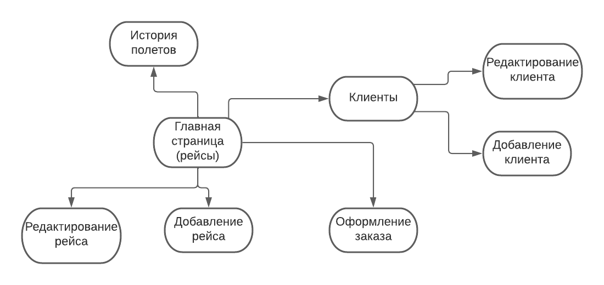

# WEB_CMC_PRAK
# Система информации об авиарейсах и билетах
Схема базы данных
-----------------

Описание страниц
-----------------------

На каждой странице верхнее меню с кнопками:

- "Главная" -> список авиарейсов
- "Клиенты" -> список клиентов
- "История полетов" -> поиск всех заказов юзеров

#### 1. Главная страница

- список авиарейсов
- около каждого рейса есть кнопка "Удалить" и "Редактировать" (вторая ведет на страницу редактирования)
- справа кнопка "Добавить авиарейс", которая ведет на страницу добавления авиарейсов
- справа кнопка "Оформление билета", которая ведет на страницу оформления заказа

#### 2. Редактирование рейса

- указывается новая информация о рейсе:
  - id аэропорта отбытия
  - id аэропорта прибытия
  - дата и время отбытия
  - дата и время прибытия
  - стоимость полета
  - количество мест
  - количество свободных мест
- кнопка "Редактировать"

#### 3. Добавление рейса

- указывается информация о новом рейсе:
  - id аэропорта отбытия
  - id аэропорта прибытия
  - дата и время отбытия
  - дата и время прибытия
  - стоимость полета
  - количество мест
  - количество свободных мест
- кнопка "Добавить"

#### 4. Оформление билета

- указывается информация для создания билета:
  - id рейса
  - id клиента
  - статус билета

#### 5. Клиенты

- список клиентов
- около каждого клиента есть кнопка "Удалить" и "Редактировать" (вторая ведет на страницу редактирования)
- справа кнопка "Добавить клиента", которая ведет на страницу добавления клиента

#### 6. Редактирование клиента

- указывается новая информация о клиенте:
  - ФИО клиента
  - email клиента
  - телефон клиента
- кнопка "Редактировать"

#### 7. Добавление клиента

- указывается информация о новом клиенте:
  - ФИО клиента
  - email клиента
  - телефон клиента
- кнопка "Добавить"

#### 8. История полетов

- указывается id клиента:
- кнопка "Получить историю полетов"
  - появится список рейсов на которых летал клиент

Некоторые сценарии использования
----------------------

- Получение списка авиарейсов
  - Перейти на главную страницу

- Получение списка клиентов
  - Перейти на страницу "Клиенты"

- Получение истории заказов клиента
  - Перейти на страницу "История полетов"
  - Ввести id клиента и нажать кнопку "Получить историю полетов"

- Заказ и оплата билетов на выбранный рейс
  - Перейти на главную страницу
  - нажать кнопку "Оформление билета"
  - Ввести данные
  - Нажать кнопку "Оформить"

- Добавление и удаление рейса, чтение и редактирование данных о нем
  - Перейти на главную страницу
  - Нажать кнопку "Редактировать" или "Добавить авиарейс" или "Удалить"
  - В первых двух случаях ввести информацию и нажать кнопки редактировать и добавить

- Добавление и удаление клиента, чтение и редактирование данных о нем
  - Перейти на страницу "Клиенты"
  - Нажать кнопку "Редактировать" или "Добавить клиента" или "Удалить"
  - В первых двух случаях ввести информацию и нажать кнопки редактировать и добавить
