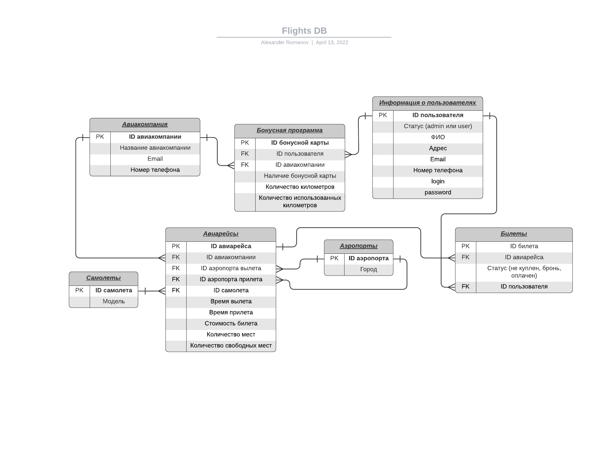

# WEB_CMC_PRAK
# Система информации об авиарейсах и билетах
Схема базы данных
-----------------

Описание страниц
-----------------------

На каждой странице верхнее меню с кнопками:

- "Главная" -> приветствие
- "Авиарейсы" -> список авиарейсов с информацией
- "Самолеты" -> список самолетов с информацией
- "Авторизация" -> страница авторизации (если не выполнен вход)
- "Личный кабинет" -> личный кабинет (если выполнен вход)

#### 1. Главная страница

- Приветствие

#### 2. Авиакомпании

- подробная информация об авиакомпаниях:
  - название
  - Email
  - Номер телефона

#### 3. Авиарейсы

- подробная информация об авиарейсах:
  - номер
  - название авиакомпании
  - название аэропорта вылета
  - название аэропорта прилета
  - название самолета
  - время вылета
  - время прилета
  - стоимость билета
  - количество мест
  - количество свободных мест
- кнопка "Заказ / Бронь" -> Оформление заказа / бронь (около каждого авиарейса) (если выполнен вход)
- кнопка "Сортировка" - откроется виджет для отбора авиарейсов по нужным характеристикам (по описанию выше) (находится сверху таблицы авиарейсов)

#### 4. Самолеты

- подробная информация о самолетах:
  - модель
  - вместимость

#### 5. Авторизация

- данные пользователя для входа:
  - логин
  - пароль
- кнопка "Войти" -> Личный кабинет пользователя или администратора (если данные подошли)

#### 6. Личный кабинет пользователя

- информация о пользователе:
  - ФИО
  - адрес
  - email
  - номер телефона
- кнопка "Информация о заказах" -> История заказов клиента, информация о его бонусах и их использовании

#### 7. Личный кабинет администратора

- информация об администраторе:
  - ФИО
  - адрес
  - email
  - номер телефона
- кнопка "Информация о заказах" -> История заказов клиента, информация о его бонусах и их использовании
- кнопка "Изменение информации о пользователе" -> Добавление/удаление/просмотр информации о пользователе
- кнопка "Изменение информации о рейсе" -> Добавление/удаление/просмотр информации о рейсе

#### 8. Оформление заказа / бронь

- информация об оплате:
  - номер карты
  - имя владельца карты
  - CVC код
- кнопка "Оформить заказ" -> личный кабинет (сообщение об успешности оплаты)

#### 9. Добавление/удаление/просмотр информации о пользователе

- выбрать параметр (добавить, удалить, просмотреть, изменить)
- просмотр информации:
  - id пользователя
- добавить пользователя:
  - ФИО
  - адрес
  - email
  - номер телефона
  - login
  - password
- удалить пользователя:
  - id пользователя
- изменить информацию:
  - id пользователя
  - ФИО
  - адрес
  - email
  - номер телефона
  - login
  - password
- кнопка "Выполнить"

#### 10. Добавление/удаление/просмотр информации о рейсе
- выбрать параметр (добавить, удалить, просмотреть, изменить)
- просмотр информации:
  - id рейса
- добавить рейс:
  - название авиакомпании
  - название аэропорта вылета
  - название аэропорта прилета
  - название самолета
  - время вылета
  - время прилета
  - стоимость билета
  - количество мест
  - количество свободных мест
- удалить рейс:
  - id рейса
- изменение информации:
  - id авиарейса
  - название авиакомпании
  - название аэропорта вылета
  - название аэропорта прилета
  - название самолета
  - время вылета
  - время прилета
  - стоимость билета
  - количество мест
  - количество свободных мест
- кнопка "Выполнить"
- для параметра "Просмотреть":
  - кнопка "Сортировка" (по данным рейса)
  - кнопка "Поиск"

#### 11. История заказов клиента, информация о его бонусах и их использовании
- просмотр информации:
  - id пользователя (Доступна администратору, пользователь получает информацию сразу)
- кнопка "Посмотреть информацию" -> вывод информации о бонусных программах юзера (администратор)
- данные по авиакомпаниям:
  - название авиакомпании
  - наличие бонусной карты
  - количество километров
  - количество использованных километров в бонусной программе
- данные о билетах
  - номер билета
  - номер авиарейса
  - статус

Некоторые сценарии использования
----------------------

- Просмотр информации об авиакомпаниях
  - Перейти на страницу об авиакомпаниях

- Просмотр информации о самолетах
  - Перейти на страницу о самолетах

- Вход в аккаунт
  - Перейти на страницу авторизации
  - Ввести данные аккаунта
  - Нажать кнопку "Войти"

- Получение списка авиарейсов по датам и направлениям, информации о ценах билетов и наличии свободных мест
  - Перейти на страницу авиарейсов
  - нажать кнопку "Сортировка"
  - Выбрать необходимые параметры
  - Нажать кнопку "Поиск"

- Получение списка клиентов, в т.ч. летавших определенным рейсом, любыми рейсами авиакомпании, заказавших и оплативших билеты
  - Перейти в личный кабинет (администратор)
  - Нажать кнопку "Изменение информации о рейсе"
  - Выбрать параметр "Просмотреть"
  - Ввести данные о рейсе
  - Нажать кнопку "Сортировка"
  - Выбрать необходимые параметры
  - Нажать кнопку "Поиск"

- Получение истории заказов клиента, информации о его бонусах и их использовании
  - Перейти в личный кабинет
  - Нажать кнопку "Информация о заказах пользователя"
  - Ввести данные пользователя (администратор)
  - Нажать кнопку "Поиск" (администратор)

- Заказ и оплата билетов на выбранный рейс
  - Перейти на страницу авиарейсов
  - Если выполнен вход в аккаунт то нажать кнопку "Заказ / Бронь"
  - Ввести данные о карте
  - Нажать кнопку "Оформить заказ"

- Добавление и удаление рейса, чтение и редактирование данных о нем
  - Перейти в личный кабинет (администратор)
  - Нажать кнопку "Изменение информации о рейсе"
  - Выбрать параметр (Добавить, Удалить, Просмотреть, Изменить)
  - Ввести необходимые данные
  - Нажать кнопку "Выполнить"

- Добавление и удаление клиента, чтение и редактирование данных о нем
  - Перейти в личный кабинет (администратор)
  - Нажать кнопку "Изменение информации о пользователе"
  - Выбрать параметр (Добавить, Удалить, Просмотреть, Изменить)
  - Ввести необходимые данные
  - Нажать кнопку "Выполнить"
